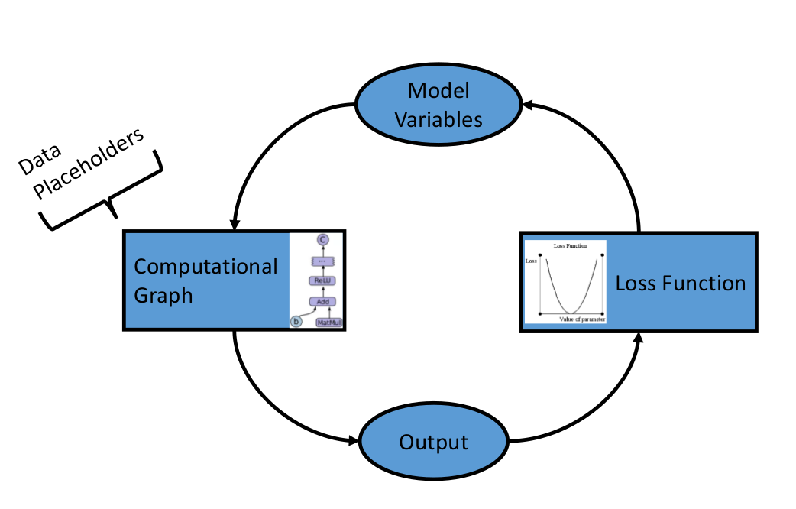

# Introduction to How TensorFlow Graphs Work

For more detail, see the [Jupyter Notebook](01_How_TensorFlow_Works.ipynb).

TensorFlow has a unique way of solving problems. This unique way allows for solving of machine learning problems very efficiently.  There are a few common steps to most TensorFlow algorithms.

 1. Import data, generate data, or setup a data-pipeline through placeholders.

 2. Feed data through computational graph.

 3. Evaluate output on loss function.

 4. Use backpropagation to modify the variables.

 5. Repeat until stopping condition.

Now there are many more subtleties to many of the algorithms that we will cover in the book.  We will talk about how to transform data, normalize data, use variables, create placeholders, initialize objects, define the computational graph structure, create loss functions, train models, and evaluate the results.

### TO DO

 - Add more documentation, explanations, and resources.
