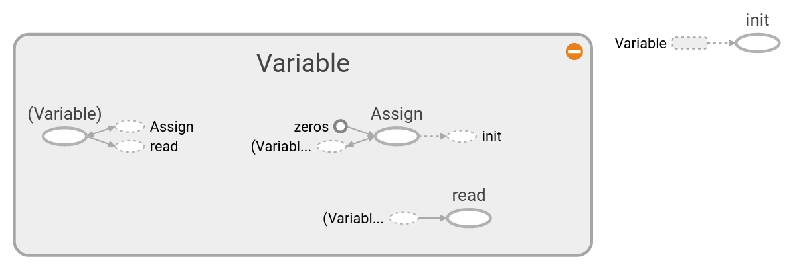
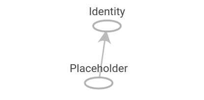

.. note::
       
       在这一章中，我们会介绍基本概念，以便理解TensorFlow是如何工作以及如何获得本书的数据和额外资源。

章节
----

.. toctree::
       :maxdepth: 3
       :caption: TensorFlow如何工作
       
       /01_Introduction/01_How_TensorFlow_Works/index

Here we introduce TensorFlow and the general outline of how most TensorFlow algorithms work.

.. image:: images/01_outline.png

下载本章 :download:`Jupyter Notebook </01_Introduction/01_How_TensorFlow_Works/01_How_TensorFlow_Works.ipynb>`

------------

.. toctree::
       :maxdepth: 3
       :caption: 变量和张量的声明

How to create and initialize tensors in TensorFlow.  We also depict how these operations appear in Tensorboard.

-----

.. toctree::
       :maxdepth: 3
       :caption: 使用占位符和变量

How to create and use variables and placeholders in TensorFlow.  We also depict how these operations appear in Tensorboard.

-----------

.. toctree::
       :maxdepth: 3
       :caption: 矩阵

Understanding how TensorFlow can work with matrices is crucial to understanding how the algorithms work.

-----------

.. toctree::
       :maxdepth: 3
       :caption: 操作符的声明

How to use various mathematical operations in TensorFlow.

-------------

.. toctree::
       :maxdepth: 3
       :caption: 载入激活函数

Activation functions are unique functions that TensorFlow has built in for your use in algorithms.

.. image:: images/06_activation_funs1.png

.. image:: images/06_activation_funs2.png

-----------

.. toctree::
       :maxdepth: 3
       :caption: 数据资源

Here we show how to access all the various required data sources in the book. There are also links describing
the data sources and where they come from.

------------

.. toctree::
       :maxdepth: 3
       :caption: 资源库

Mostly official resources and papers.  The papers are TensorFlow papers or Deep Learning resources.

本章学习模块
-----------

.. Submodules
.. ----------

tensorflow\.zeros
^^^^^^^^^^^^^^^^^
.. automodule:: tensorflow.zeros
    :members:
    :undoc-members:
    :show-inheritance:

tensorflow\.ones
^^^^^^^^^^^^^^^^^
.. automodule:: tensorflow.ones
    :members:
    :undoc-members:
    :show-inheritance:

tensorflow\.fill
^^^^^^^^^^^^^^^^^
.. automodule:: tensorflow.fill
    :members:
    :undoc-members:
    :show-inheritance:

tensorflow\.constant
^^^^^^^^^^^^^^^^^
.. automodule:: tensorflow.constant
    :members:
    :undoc-members:
    :show-inheritance:

tensorflow\.zeros_like
^^^^^^^^^^^^^^^^^
.. automodule:: tensorflow.zeros_like
    :members:
    :undoc-members:
    :show-inheritance:

tensorflow\.ones_like
^^^^^^^^^^^^^^^^^
.. automodule:: tensorflow.ones_like
    :members:
    :undoc-members:
    :show-inheritance:

tensorflow\.linspace
^^^^^^^^^^^^^^^^^
.. automodule:: tensorflow.linspace
    :members:
    :undoc-members:
    :show-inheritance:

tensorflow\.range
^^^^^^^^^^^^^^^^^   
.. automodule:: tensorflow.range
    :members:
    :undoc-members:

tensorflow\.random_uniform_initializer
^^^^^^^^^^^^^^^^^
.. automodule:: tensorflow.random_uniform_initializer
    :members:
    :undoc-members:

tensorflow\.random_normal_initializer
^^^^^^^^^^^^^^^^^
.. automodule:: tensorflow.random_normal_initializer
    :members:
    :undoc-members:
