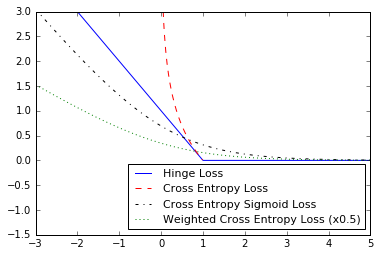

# Implementing Loss Functions

## Summary

In this script, we will show how to implement different loss functions in tensorflow

## Plots of the Loss Functions

The output of the script in this section plots the various loss functions:

