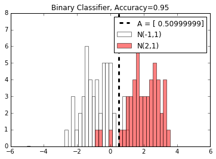

# Evaluating Models

## Summary

Here we will perform two modeling tasks: regression and classification.  We will show how to evaluate the models in the TensorFlow algorithm

## Regression Model

The regression model is from a prior section.  We will generate input data which will be distributed as Normal(mean=1, sd=0.1) and target data or repeating 10.0 values.  The model will optimize a multiplication factor (theoretically = 10) to predict the target data.

## Classification Model

The classification model will be half values from Normal(mean=-1, sd=1) and half from Normal(mean=2, sd=1).  There will be some overlap in the distributions.  The classification model will optimize on predicting a middle point, of which is will classify everything less than it as the first distribution and everything greater than it as the latter distribution.  Theoretically, we know that the ideal cutoff is between the two normals at x = 0.5.

## Outline

The idea is that we want to split our labeled data set into a training and test set.  We then train on the test set, and look at the accuracy on the test set.

## Classification Results

Here is the classification results visualized as a histogram:

