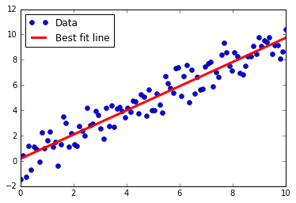

# Using the Matrix Inverse Method

Here we implement solving 2D linear regression via the matrix inverse method in TensorFlow.

# Model

Given A * x = b, we can solve for x via:

(t(A) * A) * x = t(A) * b

x = (t(A) * A)^(-1) * t(A) * b

Here, note that t(A) is the transpose of A.

# Graph of linear fit

