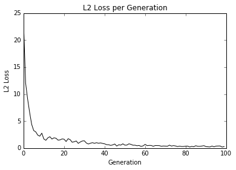
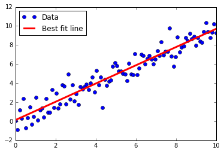

# Learning the TensorFlow Way of Regression

In this section we will implement linear regression as an iterative computational graph in TensorFlow.  To make this more pertinent, instead of using generated data, we will instead use the Iris data set.  Our x will be the Petal Width, our y will be the Sepal Length.  Viewing the data in these two dimensions suggests a linear relationship.

# Model

The the output of our model is a 2D linear regression:

y = A * x + b

The x matrix input will be a 2D matrix, where it's dimensions will be (batch size x 1).  The y target output will have the same dimensions, (batch size x 1).

The loss function we will use will be the mean of the batch L2 Loss:

loss = mean( (y\_target - model\_output)^2 )

We will then iterate through random batch size selections of the data.

# Graph of Loss Function

# Graph of Linear Fit

