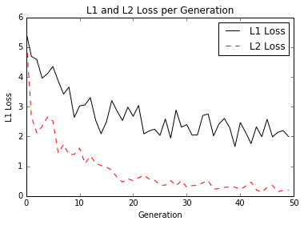
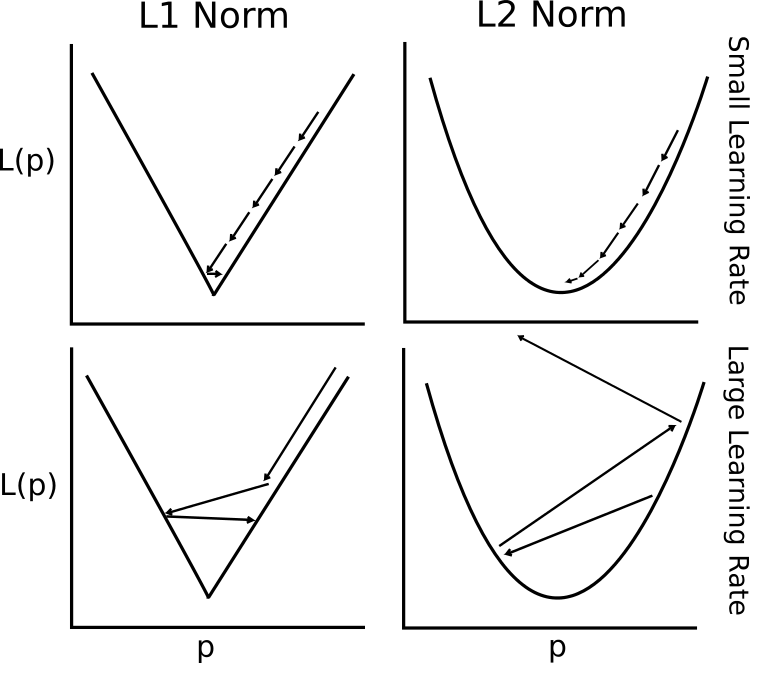

# Loss Functions in Linear Regression

The choice of loss function can significantly impact the convergence of TensorFlow algorithms.  We will compare and contrast using the L1 and L2 loss functions for linear regression.

# L1 Loss

The L1 loss is the absolute value of the difference between the target (y) and the prediction (p):

L1(y,p) = |y - p|

# L2 Loss

The L2 loss is the squared difference between the target (y) and the prediction (p):

L2(y,p) = (y - p)^2

## Summary

| L2 Loss         | L1 Loss       |
|-----------------|---------------|
| More stable     | Less Stable   |
| Not very robust | Robust        |

# Graph of L1 vs L2 Loss Functions

# Graph of L1 vs L2 Loss Functions (L2 not converging)

Here is an example of the L2 function not converging.  Despite a large learning rate, L1 has converged but L2 has not.

# Graphical Summary of L1 and L2 with Learning Rates

Here is a plot of a 1D example of L1 and L2 loss with a small and large learning rate.

To note:

### Top Left
 - L1 loss with small learning rate:  Robust, converges, but may take a while to converge.

### Top Right
 - L2 loss with small learning rate: Robust, converges, but may take a while to converge.

### Bottom Left
 - L1 loss with large learning rate: More robust, and less likely to explode, but may bounce around the optimum at the end.

### Bottom Right
 - L2 loss with large learning rate: Not robust, explodes because of large learning rate. Very sensitive to learning rate.

Moral of the story: When your algorithm isn't converging, try decreasing the learning rate first.
