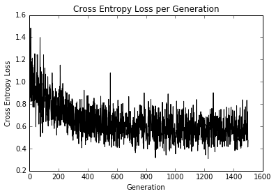
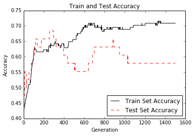

# Implementing Logistic Regression

Logistic regression is a way to predict a number between zero or one (usually we consider the output a probability). This prediction is classified into class value ‘1’ if the prediction is above a specified cut off value and class ‘0’ otherwise.  The standard cutoff is 0.5.  For the purpose of this example, we will specify that cut off to be 0.5, which will make the classification as simple as rounding the output.

The data we will use for this example will be the [UMASS low birth weight data](https://www.umass.edu/statdata/statdata/data/lowbwt.txt).

# Model

The the output of our model is the standard logistic regression:

y = sigmoid(A * x + b)

The x matrix input will have dimensions (batch size x # features).  The y target output will have the dimension batch size x 1.

The loss function we will use will be the mean of the cross-entropy loss:

loss = mean( - y * log(predicted) + (1-y) * log(1-predicted) )

TensorFlow has this cross entropy built in, and we can use the function, 'tf.nn.sigmoid\_cross\_entropy\_with\_logits()'

We will then iterate through random batch size selections of the data.

# Graph of Loss Function

Running the script should result in a similar loss and accuracy output.

# Accuracy of Train and Test Sets

