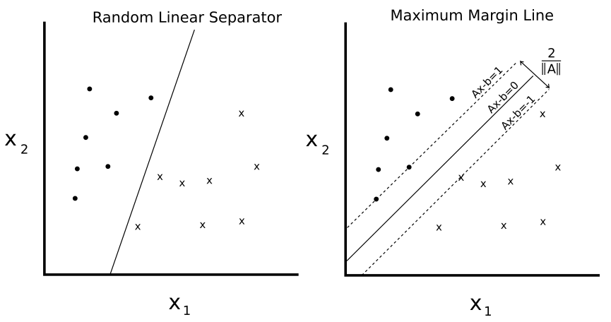

# Support Vector Machine Introduction

Support Vector Machines (SVMs) are a machine learning method to separate binary classes. This is accomplished by maximizing a margin width between two classes.  It is extended to allow for noise in the data, when the two classes are not explicitly linear separable.  SVMs can be extended to separate non linear classes by using non-linear kernels.  After this, we finish this chapter by showing how to extend these binary classifies into multi-class problems via a one-vs-all method.
