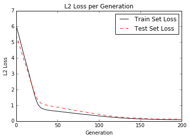
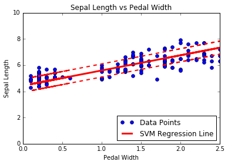

# SVM Reduction to Linear Regression

Instead of optimizing the maximal linear separator, we change the loss function to maximize the amount of data points we can make fit in our margin.  This will give us a linear regression estimation.

