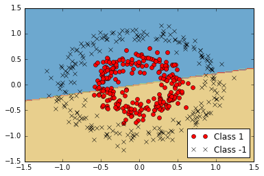
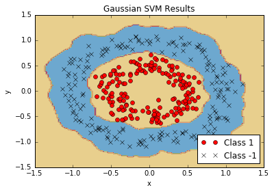

# Working with Kernels

Linear SVMs are very powerful.  But sometimes the data are not very linear.  To this end, we can use the 'kernel trick' to map our data into a higher dimensional space, where it may be linearly separable.  Doing this allows us to separate out non-linear classes.  See the below example.

If we attempt to separate the below circular-ring shaped classes with a standard linear SVM, we fail.

But if we separate it with a Gaussian-RBF kernel, we can find a linear separator in a higher dimension that works a lot better.

