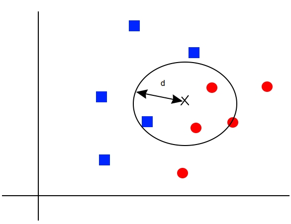

# Nearest Neighbor Methods Introduction

This chapter will focus on nearest neighbor methods and how to implement them in TensorFlow. We will start with an introduction to the method and show how to implement various forms, and the chapter will end with examples of address matching and image recognition. This is what we will cover:

 - Working with Nearest Neighbors

 - Working with Text-Based Distances

 - Computing Mixed Distance Functions

 - Using an Address Matching Example

 - Using Nearest Neighbors for Image Recognition

Nearest neighbor methods are based on a distance-based conceptual idea. We consider our training set as the model and make predictions on new points based on how close they are to points in the training set. A naïve way is to make the prediction as the closest training data point class. But since most datasets contain a degree of noise, a more common method would be to take a weighted average of a set of k nearest neighbors. This method is called k-nearest neighbors (k-NN).

Given a training dataset (x1, x2, ..., xn),  with corresponding targets (y1, y2, ..., yn), we can make a prediction on a point, z, by looking at a set of nearest neighbors. The actual method of prediction depends on whether or not we are doing regression (continuous y) or classification (discrete y).

For discrete classification targets, the prediction may be given by a maximum voting scheme weighted by the distance to the prediction point:

prediction(z) = max ( weighted sum of distances of points in each class )

 - see jupyter notebook for the formula

Here, our prediction is the maximum weighted value over all classes (j), where the weighted distance from the prediction point is usually given by the L1 or L2 distance functions.

Continuous targets are very similar, but we usually just compute a weighted average of the target variable (y) by distance.

There are many different specifications of distance metrics that we can choose. In this chapter, we will explore the L1 and L2 metrics as well as edit and textual distances.

We also have to choose how to weight the distances. A straight forward way to weight the distances is by the distance itself. Points that are further away from our prediction should have less impact than nearer points. The most common way to weight is by the normalized inverse of the distance. We will implement this method in the next recipe.

Note that k-NN is an aggregating method. For regression, we are performing a weighted average of neighbors. Because of this, predictions will be less extreme and less varied than the actual targets. The magnitude of this effect will be determined by k, the number of neighbors in the algorithm.
