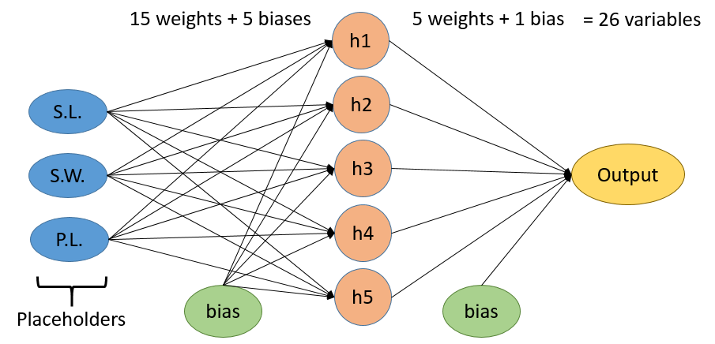
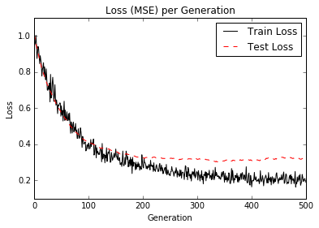

# Implementing a One Layer Neural Network

We will use the [Iris data](http://scikit-learn.org/stable/auto_examples/datasets/plot_iris_dataset.html) for this exercise.  We will build a one-hidden layer fully connected neural network to predict one of the flower attributes from the other three.

The four flower attributes are (1) sepal length, (2) sepal width, (3) pedal length, and (4) pedal width.  We will use (1-3) to predict (4).  The main purpose of this section is to illustrate how neural networks can implement regression just as easily as classification.  Later on in this chapter, we will extend this model to have multiple hidden layers.

# Model

The model will have one hidden layer.  If the hidden layer has 10 nodes, then the model will look like the following:

We will use the ReLU activation functions.

For the loss function, we will use the average MSE across the batch.

# Graph of Loss Function (Average Batch MSE)

Running the script should result in a similar loss.

