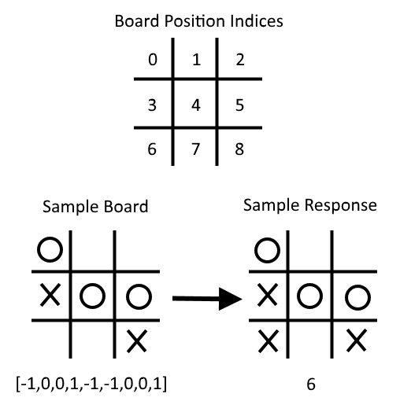
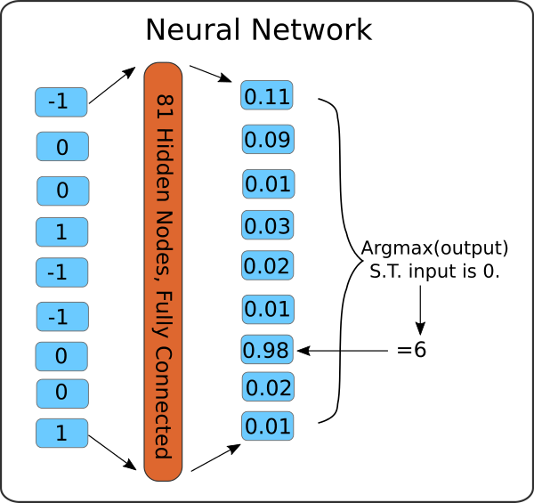
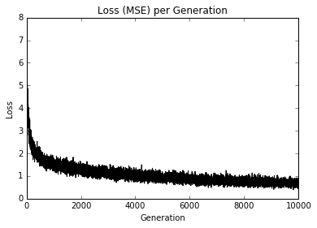

# Learning to Play Tic-Tac-Toe

## Goal

This example intends to feed examples of best moves for many different board combinations into a neural network in order to train the model to play Tic-Tac-Toe.

The end of the script provides the user a chance to play against the trained model by asking for input moves and feeding such input moves into the model.

## Data Format

All tic-tac-toe boards can be reduced down to a small number of boards, if we consider all geometric transformations on them.  Such geometric transformations include:

 - Rotate 90 deg.
 - Rotate 180 deg.
 - Rotate 270 deg.
 - Vertical reflection.
 - Horizontal reflection.

All possible boards can be generated from the base board with at most 2 transformations.

The file base\_tic\_tac\_toe\_moves.csv contains rows, each of which represents a unique board representation with the desired best play tactic.

We denote the board spaces as such, 'X' = 1, 'O'= -1, and an empty space will have a zero in it.  The last column is the index of the best play response.  A board will be indexed as follows:
```
 0 | 1 | 2
 ---------
 3 | 4 | 5
 ---------
 6 | 7 | 8
```
So for example, the board:
```
 O |   |
 ---------
 X | O | O
 ---------
   |   | X
```
is equivalent to the row: [-1, 0, 0, 1, -1, -1, 0, 0, 1].



## Neural Network Architecture

We will keep it simple and have only one hidden layer that is fully connected.  The hidden layer will be composed of 81 hidden nodes. If only because square numbers are appealing.  See the below diagram for the NN we will construct.



## Important Functions

There are a few important functions in the beginning of the code.

 1. print_board(): takes a board vector and shows it as a tic-tac-toe board.
 2. get_symmetry(): takes a board, the preferred response index, and a transformation.  It then applies the transformation to the board and response to get a new vector.

At the end of the code, we loop through an actual game.  This allows the user to actually play the model they created.

[See Code Here](tic_tac_toe_moves.py)

## Sample Game Output

Here is a sample of the output of playing against the trained model. Human = X's and the model = O's.

```
Input index of your move (0-8): 4
Model has moved
 O |   |
___________
   | X |
___________
   |   |

Input index of your move (0-8): 6
Model has moved
 O |   |
___________
   | X |
___________
 X | O |

Input index of your move (0-8): 2
Model has moved
 O |   | X
___________
   | X | O
___________
 X | O |
Game Over!
```

## Loss Output


