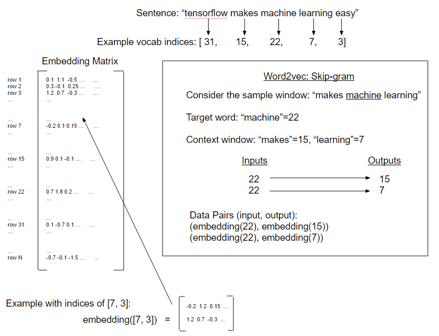

# Working with Skip Gram Embeddings

Prior to this recipe, we have not considered the order of words to be relevant in creating word embeddings. In early 2013, Tomas Mikolov and other researchers at Google authored a paper about creating word embeddings that address this issue (https://arxiv.org/abs/1301.3781), and they named their methods “word2vec”.

The basic idea is to create word embeddings that capture a relational aspect of words.  We seek to understand how various words are related to each other. Some examples of how these embeddings might behave are as follows.

 - “king” – “man” + “woman” = “queen”
 - “india pale ale” – “hops” + “malt” = “stout”

We might achieve such numerical representation of words if we only consider their positional relationship to each other.  If we could analyse a large enough source of coherent documents, we might find that the words “king”, “man”, and “queen” are mentioned closely to each other in our texts.  If we also know that “man” and “woman” are related in a different way, then we might conclude that “man” is to “king” as “woman” is to “queen” and so on.

To go about finding such an embedding, we will use a neural network that predicts surrounding words giving an input word.  We could, just as easily, switched that and tried to predict a target word given a set of surrounding words, but we will start with the prior method.  Both are variations of the word2vec procedure. But the prior method of predicting the surrounding words (the context) from a target word is called the skip-gram model.  In the next recipe, we will implement the other method, predicting the target word from the context, which is called the continuous bag of words method (CBOW).

See below figure for an illustration.

