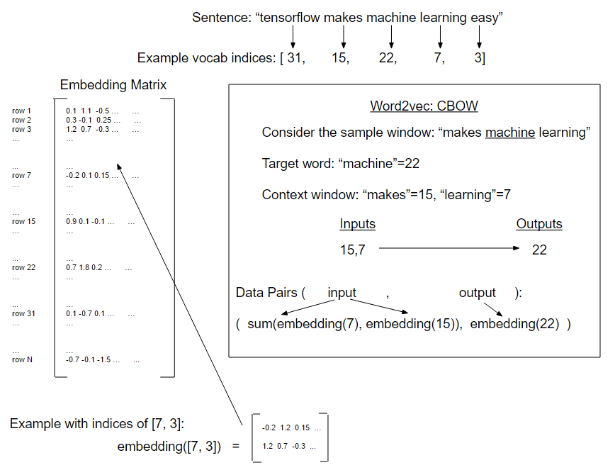

# Working with CBOW Embeddings

In this recipe we will implement the CBOW (continuous bag of words) method of word2vec. It is very similar to the skip-gram method, except we are predicting a single target word from a surrounding window of context words.

In the prior example we treated each combination of window and target as a group of paired inputs and outputs, but with CBOW we will add the surrounding window embeddings together to get one embedding to predict the target word embedding.

Most of the code will stay the same, except we will need to change how we create the embeddings and how we generate the data from the sentences.

To make the code easier to read, we have moved all the major functions to a separate file, called ‘text_helpers.py’ in the same directory.  This function holds the data loading, text normalization, dictionary creation, and batch generation functions.  This functions are exactly as they appear in the prior recipe, “Working with Skip-gram Embeddings”, except where noted.

See the following illustration of a CBOW example.

