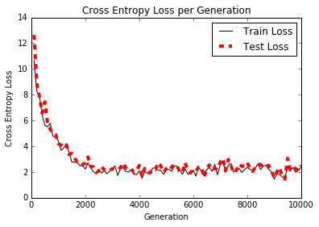

# Sentiment Analysis with Doc2Vec

In the prior sections about word2vec methods, we have managed to capture positional relationships between words.  What we have not done is capture the relationship of words to the document (or movie review) that they come from.  One extension of word2vec that captures a document effect is called doc2vec.

The basic idea of doc2vec is to introduce a document embedding, along with the word embeddings, that may help to capture the tone of the document. For example, just knowing that the words “movie” and “love” are nearby to each other may not help us determine the sentiment of the review.  The review maybe talking about how they love the move or how they do not love the move.  But if the review is long enough and more negative words are found in the document, maybe we can pick up on an overall tone that may help us predict the next words.

Doc2vec simply adds an additional embedding matrix for the documents and uses a window of words plus the document index to predict the next word.  All word windows in a document have the same document index.  It is worthwhile to mention that it is important to think about how we will combine the document embedding and the word embeddings.  We combine the word embeddings in the word window by taking the sum.  And there are two main ways to combine these embeddings with the document embedding.

Commonly, the document embedding is either (1) added to the word embeddings, or (2) concatenated to the end of the word embeddings.  If we add the two embeddings we limit the document embedding size to be the same size as the word embedding size.  If we concatenate, we lift that restriction, but increase the number of variables that the logistic regression must deal with.  For illustrative purposes, we show how to deal with concatenation in this recipe.  But in general, for smaller datasets, addition is the better choice.

The first step will be to fit both the document and word embeddings on the whole corpus of movie reviews, then we perform a train-test split and train a logistic model and see if we can improve upon the accuracy of predicting the review sentiment.

Example training-loss for logistic regression on doc2vec embeddings for movie-review sentiment dataset:

