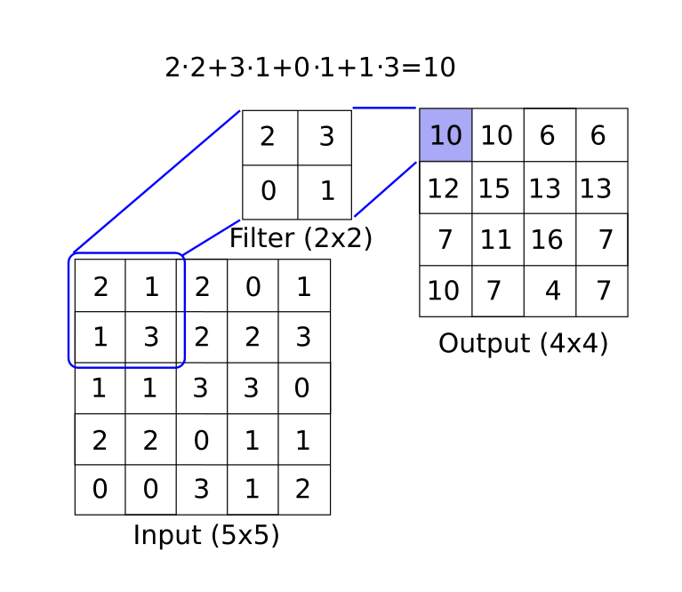
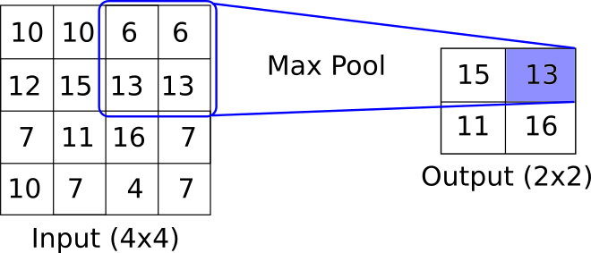

## Introduction to Convolutional Neural Networks

Convolutional Neural Networks (CNNs) are responsible for the latest major breakthroughs in image recognition in the past few years.

In mathematics, a convolution is a function which is applied over the output of another function.  In our case, we will consider applying a matrix mutliplication (filter) across an image. See the below diagram for an example of how this may work.

CNNs generally follow a structure.  The main convolutional setup is (input array) -> (convolutional filter layer) -> (Pooling) -> (Activation layer).  The above diagram depicts how a convolutional layer may create one feature.  Generally, filters are multidimensional and end up creating many features.  It is also common to have a completely separate filter-feature creator of different sizes acting on the same layer.  After this convolutional filter, it is common to apply a pooling layer.  This pooling may be a max-pooling or an average pooling or another aggregation.  One of the key concepts here is that the pooling layer has no parameters- while decreasing the layer size.  See the below diagram for an example of max-pooling.

After the max pooling, there is generally an activation layer.  One of the more common activation layers is the ReLU (Rectified Linear Unit).  See [Chapter 1, Section 6](../../01_Introduction/06_Implementing_Activation_Functions) for examples.
