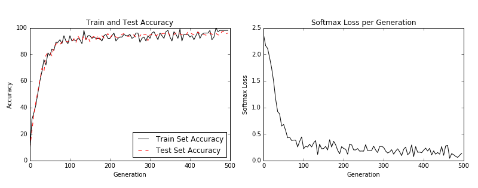

Introduction to CNN with MNIST
==============================

Here we illustrate how to use a simple CNN with three convolutional units to predict the MNIST handwritten digits.  There is good reason why this dataset is used like the 'hello world' of image recognition, it is fairly compact while having a decent amount of training, test, and validation data.  It only has one channel (black and white) and only ten possible outputs (0-9).

When the script is done training the model, you should see similar output to the following graphs.

Training and test loss (left) and test batch accuracy (right).

A random set of 6 digits with actuals and predicted labels. You can see a prediction failure in the lower right box.
