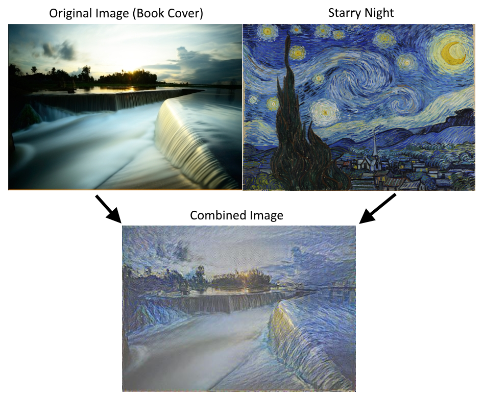

Stylenet / Neural-Style
=======================

The purpose of this script is to illustrate how to do stylenet in TensorFlow.  We reference the following [paper](https://arxiv.org/abs/1508.06576) for this algorithm.

## Prerequisites
 * Download the VGG-verydeep-19.mat file [here](http://www.vlfeat.org/matconvnet/models/beta16/imagenet-vgg-verydeep-19.mat).
 * You must download two images, a [style image](../images/starry_night.jpg) and a [content image](../images/book_cover.jpg) for the algorithm to blend. (Image links are to the images used in the book.)

The algorithm will output temporary images during training.

