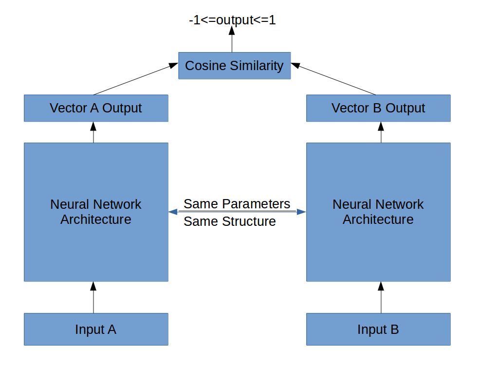
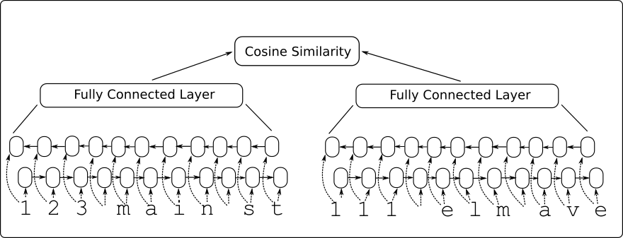
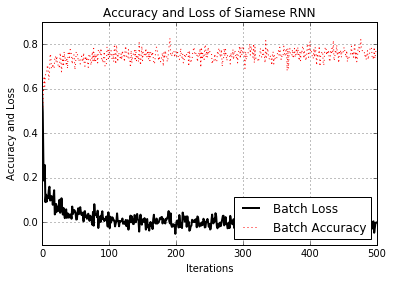

# Training a Siamese Similarity Measure (RNNs)

In this recipe, we will train a model to perform address matching, and consider addresses as string inputs. The model will use a siamese network to calculate the similarity between an input address and a set of canonical addresses.  The canonical address that is the closest (highest similarity score) is chosen as the true address.

# Benefits of Siamese Networks

The benefits of using a siamese network is that we have at least doubled our data size (if not more) and the network will do exact matches by default, which means it will not have to learn the identity function between addresses.

Here is a general architecture of a siamese neural network:

# Data

The data we will use will be contrived data.  We generate a list of addresses as the truth, then we introduce a set of addresses that have at least one typo in them.

# Model Architecture

For this specific siamese network, we use a RNN network as the input and then run the outputs through a fully connected layer. The similarity is then just the cosine function of the two vectors as seen below.

# Graph of Loss Function and Batch Accuracy

Running the script should result in a similar loss.

