# [TensorFlow Machine Learning Cookbook](https://www.packtpub.com/big-data-and-business-intelligence/tensorflow-machine-learning-cookbook)
## [A Packt Publishing Book due out Jan. 2017.](https://www.packtpub.com/big-data-and-business-intelligence/tensorflow-machine-learning-cookbook)

### By Nick McClure

Table of Contents
=================

  * [Ch 1: Getting Started with TensorFlow](#ch-1-getting-started-with-tensorflow)
  * [Ch 2: The TensorFlow Way](#ch-2-the-tensorflow-way)
  * [Ch 3: Linear Regression](#ch-3-linear-regression)
  * [Ch 4: Support Vector Machines](#ch-4-support-vector-machines)
  * [Ch 5: Nearest Neighbor Methods](#ch-5-nearest-neighbor-methods)
  * [Ch 6: Neural Networks](#ch-6-neural-networks)
  * [Ch 7: Natural Language Processing](#ch-7-natural-language-processing)
  * [Ch 8: Convolutional Neural Networks](#ch-8-convolutional-neural-networks)
  * [Ch 9: Recurrent Neural Networks](#ch-9-recurrent-neural-networks)
  * [Ch 10: Taking TensorFlow to Production](#ch-10-taking-tensorflow-to-production)
  * [Ch 11: More with TensorFlow](#ch-11-more-with-tensorflow)

---

## [Ch 1: Getting Started with TensorFlow](01_Introduction)
<kbd>
  
</kbd>
<kbd>
  
</kbd>
<kbd>
  
</kbd>
<kbd>
  
</kbd>
<kbd>
  
</kbd>

This chapter intends to introduce the main objects and concepts in TensorFlow.  We also introduce how to access the data for the rest of the book and provide additional resources for learning about TensorFlow.

 1. [General Outline of TF Algorithms](01_Introduction/01_How_TensorFlow_Works)
  * Here we introduce TensorFlow and the general outline of how most TensorFlow algorithms work.
 2. [Creating and Using Tensors](01_Introduction/02_Creating_and_Using_Tensors)
  * How to create and initialize tensors in TensorFlow.  We also depict how these operations appear in Tensorboard.
 3. [Using Variables and Placeholders](01_Introduction/03_Using_Variables_and_Placeholders)
  * How to create and use variables and placeholders in TensorFlow.  We also depict how these operations appear in Tensorboard.
 4. [Working with Matrices](01_Introduction/04_Working_with_Matrices)
  * Understanding how TensorFlow can work with matrices is crucial to understanding how the algorithms work.
 5. [Declaring Operations](01_Introduction/05_Declaring_Operations)
  * How to use various mathematical operations in TensorFlow.
 6. [Implementing Activation Functions](01_Introduction/06_Implementing_Activation_Functions)
  * Activation functions are unique functions that TensorFlow has built in for your use in algorithms.
 7. [Working with Data Sources](01_Introduction/07_Working_with_Data_Sources)
  * Here we show how to access all the various required data sources in the book.  There are also links describing the data sources and where they come from.
 8. [Additional Resources](01_Introduction/08_Additional_Resources)
  * Mostly official resources and papers.  The papers are TensorFlow papers or Deep Learning resources.

## [Ch 2: The TensorFlow Way](02_TensorFlow_Way)
<kbd>
  
</kbd>
<kbd>
  
</kbd>
<kbd>
  
</kbd>
<kbd>
  
</kbd>
<kbd>
  
</kbd>
<kbd>
  
</kbd>
<kbd>
  
</kbd>
<kbd>
  
</kbd>

After we have established the basic objects and methods in TensorFlow, we now want to establish the components that make up TensorFlow algorithms.  We start by introducing computational graphs, and then move to loss functions and back propagation.  We end with creating a simple classifier and then show an example of evaluating regression and classification algorithms.

 1. [One Operation as a Computational Graph](02_TensorFlow_Way/01_Operations_as_a_Computational_Graph)
  * We show how to create an operation on a computational graph and how to visualize it using Tensorboard.
 2. [Layering Nested Operations](02_TensorFlow_Way/02_Layering_Nested_Operations)
  * We show how to create multiple operations on a computational graph and how to visualize them using Tensorboard.
 3. [Working with Multiple Layers](02_TensorFlow_Way/03_Working_with_Multiple_Layers)
  * Here we extend the usage of the computational graph to create multiple layers and show how they appear in Tensorboard.
 4. [Implementing Loss Functions](02_TensorFlow_Way/04_Implementing_Loss_Functions)
  * In order to train a model, we must be able to evaluate how well it is doing. This is given by loss functions. We plot various loss functions and talk about the benefits and limitations of some.
 5. [Implementing Back Propagation](02_TensorFlow_Way/05_Implementing_Back_Propagation)
  * Here we show how to use loss functions to iterate through data and back propagate errors for regression and classification.
 6. [Working with Stochastic and Batch Training](02_TensorFlow_Way/06_Working_with_Batch_and_Stochastic_Training)
  * TensorFlow makes it easy to use both batch and stochastic training. We show how to implement both and talk about the benefits and limitations of each.
 7. [Combining Everything Together](02_TensorFlow_Way/07_Combining_Everything_Together)
  * We now combine everything together that we have learned and create a simple classifier.
 8. [Evaluating Models](02_TensorFlow_Way/08_Evaluating_Models)
  * Any model is only as good as it's evaluation.  Here we show two examples of (1) evaluating a regression algorithm and (2) a classification algorithm.

## [Ch 3: Linear Regression](03_Linear_Regression)

<kbd>
  
</kbd>
<kbd>
  
</kbd>
<kbd>
  <a href="03_Linear_Regression/03_TensorFlow_Way_of_Linear_Regression">
    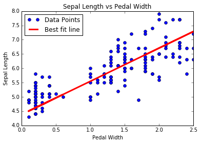
  </a>
</kbd>
<kbd>
  
</kbd>
<kbd>
  <a href="03_Linear_Regression/05_Implementing_Deming_Regression">
    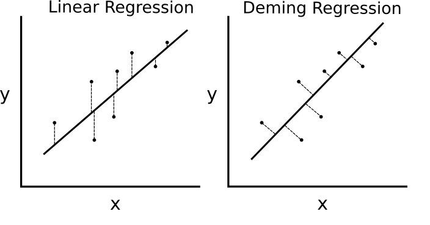
  </a>
</kbd>
<kbd>
  
</kbd>
<kbd>
  
</kbd>
<kbd>
  
</kbd>

Here we show how to implement various linear regression techniques in TensorFlow.  The first two sections show how to do standard matrix linear regression solving in TensorFlow.  The remaining six sections depict how to implement various types of regression using computational graphs in TensorFlow.

 1. [Using the Matrix Inverse Method](03_Linear_Regression/01_Using_the_Matrix_Inverse_Method)
  * How to solve a 2D regression with a matrix inverse in TensorFlow.
 2. [Implementing a Decomposition Method](03_Linear_Regression/02_Implementing_a_Decomposition_Method)
  * Solving a 2D linear regression with Cholesky decomposition.
 3. [Learning the TensorFlow Way of Linear Regression](03_Linear_Regression/03_TensorFlow_Way_of_Linear_Regression)
  * Linear regression iterating through a computational graph with L2 Loss.
 4. [Understanding Loss Functions in Linear Regression](03_Linear_Regression/04_Loss_Functions_in_Linear_Regressions)
  * L2 vs L1 loss in linear regression.  We talk about the benefits and limitations of both.
 5. [Implementing Deming Regression (Total Regression)](03_Linear_Regression/05_Implementing_Deming_Regression)
  * Deming (total) regression implemented in TensorFlow by changing the loss function.
 6. [Implementing Lasso and Ridge Regression](03_Linear_Regression/06_Implementing_Lasso_and_Ridge_Regression)
  * Lasso and Ridge regression are ways of regularizing the coefficients. We implement both of these in TensorFlow via changing the loss functions.
 7. [Implementing Elastic Net Regression](03_Linear_Regression/07_Implementing_Elasticnet_Regression)
  * Elastic net is a regularization technique that combines the L2 and L1 loss for coefficients.  We show how to implement this in TensorFlow.
 8. [Implementing Logistic Regression](03_Linear_Regression/08_Implementing_Logistic_Regression)
  * We implement logistic regression by the use of an activation function in our computational graph.

## [Ch 4: Support Vector Machines](04_Support_Vector_Machines)

<kbd>
  
</kbd>
<kbd>
  <a href="04_Support_Vector_Machines/02_Working_with_Linear_SVMs">
    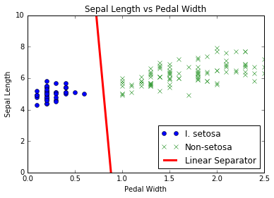
  </a>
</kbd>
<kbd>
  
</kbd>
<kbd>
  
</kbd>
<kbd>
  <a href="04_Support_Vector_Machines/05_Implementing_Nonlinear_SVMs">
    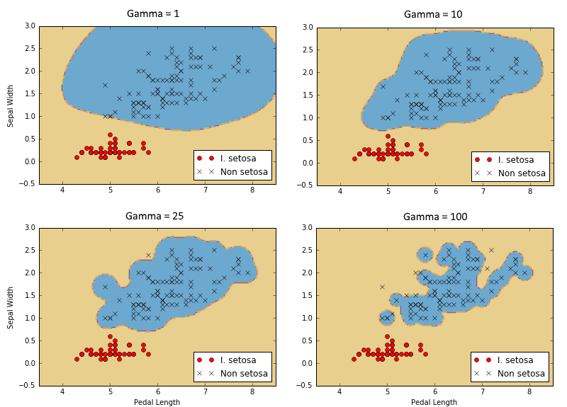
  </a>
</kbd>
<kbd>
  
</kbd>

This chapter shows how to implement various SVM methods with TensorFlow.  We first create a linear SVM and also show how it can be used for regression.  We then introduce kernels (RBF Gaussian kernel) and show how to use it to split up non-linear data. We finish with a multi-dimensional implementation of non-linear SVMs to work with multiple classes.

 1. [Introduction](04_Support_Vector_Machines/01_Introduction)
  * We introduce the concept of SVMs and how we will go about implementing them in the TensorFlow framework.
 2. [Working with Linear SVMs](04_Support_Vector_Machines/02_Working_with_Linear_SVMs)
  * We create a linear SVM to separate I. setosa based on sepal length and pedal width in the Iris data set.
 3. [Reduction to Linear Regression](04_Support_Vector_Machines/03_Reduction_to_Linear_Regression)
  * The heart of SVMs is separating classes with a line.  We change tweek the algorithm slightly to perform SVM regression.
 4. [Working with Kernels in TensorFlow](04_Support_Vector_Machines/04_Working_with_Kernels)
  * In order to extend SVMs into non-linear data, we explain and show how to implement different kernels in TensorFlow.
 5. [Implementing Non-Linear SVMs](04_Support_Vector_Machines/05_Implementing_Nonlinear_SVMs)
  * We use the Gaussian kernel (RBF) to separate non-linear classes.
 6. [Implementing Multi-class SVMs](04_Support_Vector_Machines/06_Implementing_Multiclass_SVMs)
  * SVMs are inherently binary predictors.  We show how to extend them in a one-vs-all strategy in TensorFlow.

## [Ch 5: Nearest Neighbor Methods](05_Nearest_Neighbor_Methods)
<kbd>
  
</kbd>
<kbd>
  <a href="05_Nearest_Neighbor_Methods/02_Working_with_Nearest_Neighbors">
    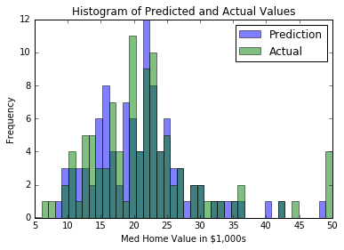
  </a>
</kbd>
<kbd>
  
</kbd>
<kbd>
  <a href="05_Nearest_Neighbor_Methods/04_Computing_with_Mixed_Distance_Functions">
    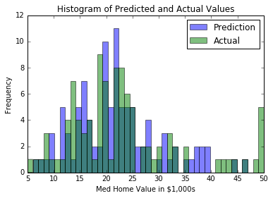
  </a>
</kbd>
<kbd>
  
</kbd>
<kbd>
  <a href="05_Nearest_Neighbor_Methods/06_Nearest_Neighbors_for_Image_Recognition">
    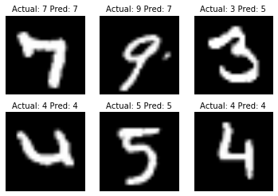
  </a>
</kbd>

Nearest Neighbor methods are a very popular ML algorithm.  We show how to implement k-Nearest Neighbors, weighted k-Nearest Neighbors, and k-Nearest Neighbors with mixed distance functions.  In this chapter we also show how to use the Levenshtein distance (edit distance) in TensorFlow, and use it to calculate the distance between strings. We end this chapter with showing how to use k-Nearest Neighbors for categorical prediction with the MNIST handwritten digit recognition.

 1. [Introduction](05_Nearest_Neighbor_Methods/01_Introduction)
  * We introduce the concepts and methods needed for performing k-Nearest Neighbors in TensorFlow.
 2. [Working with Nearest Neighbors](05_Nearest_Neighbor_Methods/02_Working_with_Nearest_Neighbors)
  * We create a nearest neighbor algorithm that tries to predict housing worth (regression).
 3. [Working with Text Based Distances](05_Nearest_Neighbor_Methods/03_Working_with_Text_Distances)
  * In order to use a distance function on text, we show how to use edit distances in TensorFlow.
 4. [Computing Mixing Distance Functions](05_Nearest_Neighbor_Methods/04_Computing_with_Mixed_Distance_Functions)
  * Here we implement scaling of the distance function by the standard deviation of the input feature for k-Nearest Neighbors.
 5. [Using Address Matching](05_Nearest_Neighbor_Methods/05_An_Address_Matching_Example)
  * We use a mixed distance function to match addresses. We use numerical distance for zip codes, and string edit distance for street names. The street names are allowed to have typos.
 6. [Using Nearest Neighbors for Image Recognition](05_Nearest_Neighbor_Methods/06_Nearest_Neighbors_for_Image_Recognition)
  * The MNIST digit image collection is a great data set for illustration of how to perform k-Nearest Neighbors for an image classification task.

## [Ch 6: Neural Networks](06_Neural_Networks)

<kbd>
  
</kbd>
<kbd>
  <a href="06_Neural_Networks/02_Implementing_an_Operational_Gate">
    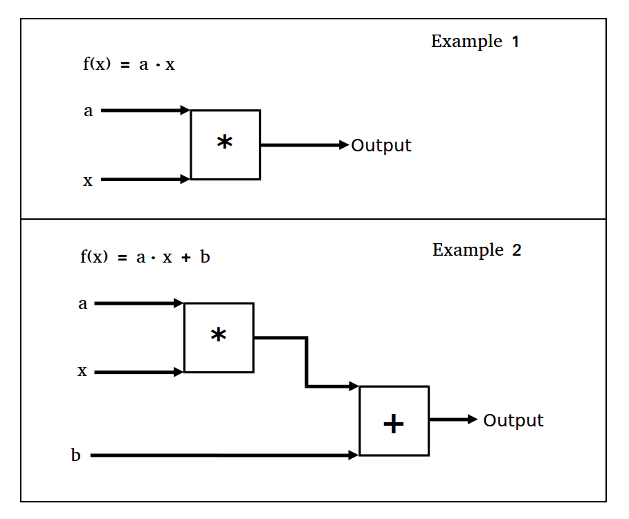
  </a>
</kbd>
<kbd>
  <a href="06_Neural_Networks/03_Working_with_Activation_Functions">
    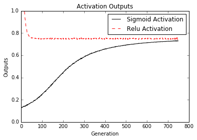
  </a>
</kbd>
<kbd>
  
</kbd>
<kbd>
  
</kbd>
<kbd>
  <a href="06_Neural_Networks/06_Using_Multiple_Layers">
    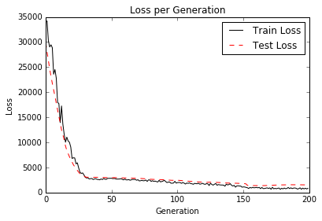
  </a>
</kbd>
<kbd>
  <a href="06_Neural_Networks/07_Improving_Linear_Regression">
    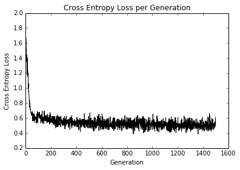
  </a>
</kbd>
<kbd>
  
</kbd>

Neural Networks are very important in machine learning and growing in popularity due to the major breakthroughs in prior unsolved problems.  We must start with introducing 'shallow' neural networks, which are very powerful and can help us improve our prior ML algorithm results.  We start by introducing the very basic NN unit, the operational gate.  We gradually add more and more to the neural network and end with training a model to play tic-tac-toe.

 1. [Introduction](06_Neural_Networks/01_Introduction)
  * We introduce the concept of neural networks and how TensorFlow is built to easily handle these algorithms.
 2. [Implementing Operational Gates](06_Neural_Networks/02_Implementing_an_Operational_Gate)
  * We implement an operational gate with one operation. Then we show how to extend this to multiple nested operations.
 3. [Working with Gates and Activation Functions](06_Neural_Networks/03_Working_with_Activation_Functions)
  * Now we have to introduce activation functions on the gates.  We show how different activation functions operate.
 4. [Implementing a One Layer Neural Network](06_Neural_Networks/04_Single_Hidden_Layer_Network)
  * We have all the pieces to start implementing our first neural network.  We do so here with regression on the Iris data set.
 5. [Implementing Different Layers](06_Neural_Networks/05_Implementing_Different_Layers)
  * This section introduces the convolution layer and the max-pool layer.  We show how to chain these together in a 1D and 2D example with fully connected layers as well.
 6. [Using Multi-layer Neural Networks](06_Neural_Networks/06_Using_Multiple_Layers)
  * Here we show how to functionalize different layers and variables for a cleaner multi-layer neural network.
 7. [Improving Predictions of Linear Models](06_Neural_Networks/07_Improving_Linear_Regression)
  * We show how we can improve the convergence of our prior logistic regression with a set of hidden layers.
 8. [Learning to Play Tic-Tac-Toe](06_Neural_Networks/08_Learning_Tic_Tac_Toe)
  * Given a set of tic-tac-toe boards and corresponding optimal moves, we train a neural network classification model to play.  At the end of the script, you can attempt to play against the trained model.

## [Ch 7: Natural Language Processing](07_Natural_Language_Processing)

<kbd>
  
</kbd>
<kbd>
  <a href="07_Natural_Language_Processing/02_Working_with_Bag_of_Words">
    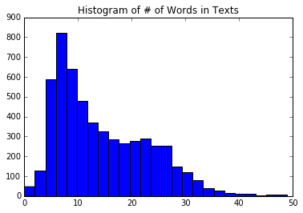
  </a>
</kbd>
<kbd>
  
</kbd>
<kbd>
  
</kbd>
<kbd>
  
</kbd>
<kbd>
  <a href="07_Natural_Language_Processing/06_Using_Word2Vec_Embeddings">
    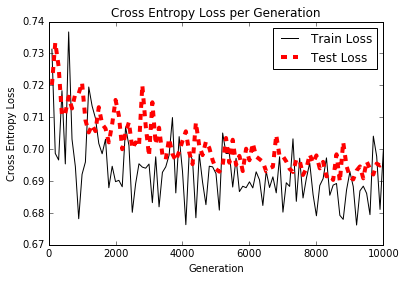
  </a>
</kbd>
<kbd>
  
</kbd>

Natural Language Processing (NLP) is a way of processing textual information into numerical summaries, features, or models. In this chapter we will motivate and explain how to best deal with text in TensorFlow.  We show how to implement the classic 'Bag-of-Words' and show that there may be better ways to embed text based on the problem at hand. There are neural network embeddings called Word2Vec (CBOW and Skip-Gram) and Doc2Vec.  We show how to implement all of these in TensorFlow.

 1. [Introduction](07_Natural_Language_Processing/01_Introduction)
  * We introduce methods for turning text into numerical vectors. We introduce the TensorFlow 'embedding' feature as well.
 2. [Working with Bag-of-Words](07_Natural_Language_Processing/02_Working_with_Bag_of_Words)
  * Here we use TensorFlow to do a one-hot-encoding of words called bag-of-words.  We use this method and logistic regression to predict if a text message is spam or ham.
 3. [Implementing TF-IDF](07_Natural_Language_Processing/03_Implementing_tf_idf)
  * We implement Text Frequency - Inverse Document Frequency (TFIDF) with a combination of Sci-kit Learn and TensorFlow. We perform logistic regression on TFIDF vectors to improve on our spam/ham text-message predictions.
 4. [Working with CBOW](07_Natural_Language_Processing/04_Working_With_Skip_Gram_Embeddings)
  * Our first implementation of Word2Vec called, "skip-gram" on a movie review database.
 5. [Working with Skip-Gram](07_Natural_Language_Processing/05_Working_With_CBOW_Embeddings)
  * Next, we implement a form of Word2Vec called, "CBOW" (Continuous Bag of Words) on a movie review database.  We also introduce method to saving and loading word embeddings.
 6. [Implementing Word2Vec Example](07_Natural_Language_Processing/06_Using_Word2Vec_Embeddings)
  * In this example, we use the prior saved CBOW word embeddings to improve on our TF-IDF logistic regression of movie review sentiment.
 7. [Performing Sentiment Analysis with Doc2Vec](07_Natural_Language_Processing/07_Sentiment_Analysis_With_Doc2Vec)
  * Here, we introduce a Doc2Vec method (concatenation of doc and word embeddings) to improve out logistic model of movie review sentiment.

## [Ch 8: Convolutional Neural Networks](08_Convolutional_Neural_Networks)

<kbd>
  
</kbd>
<kbd>
  
</kbd>
<kbd>
  
</kbd>
<kbd>
  
</kbd>
<kbd>
  
</kbd>
<kbd>
  <a href="08_Convolutional_Neural_Networks/06_Deepdream">
    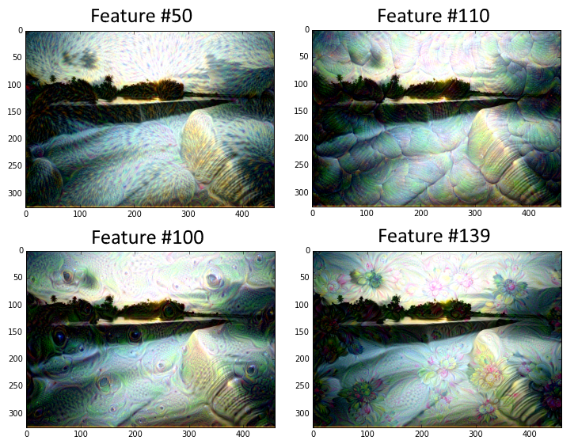
  </a>
</kbd>

Convolutional Neural Networks (CNNs) are ways of getting neural networks to deal with image data. CNN derive their name from the use of a convolutional layer that applies a fixed size filter across a larger image, recognizing a pattern in any part of the image. There are many other tools that they use (max-pooling, dropout, etc...) that we show how to implement with TensorFlow.  We also show how to retrain an existing architecture and take CNNs further with Stylenet and Deep Dream.

 1. [Introduction](08_Convolutional_Neural_Networks/01_Intro_to_CNN)
  * We introduce convolutional neural networks (CNN), and how we can use them in TensorFlow.
 2. [Implementing a Simple CNN.](08_Convolutional_Neural_Networks/02_Intro_to_CNN_MNIST)
  * Here, we show how to create a CNN architecture that performs well on the MNIST digit recognition task.
 3. [Implementing an Advanced CNN.](08_Convolutional_Neural_Networks/03_CNN_CIFAR10)
  * In this example, we show how to replicate an architecture for the CIFAR-10 image recognition task.
 4. [Retraining an Existing Architecture.](08_Convolutional_Neural_Networks/04_Retraining_Current_Architectures)
  * We show how to download and setup the CIFAR-10 data for the TensorFlow retraining/fine-tuning tutorial.
 5. [Using Stylenet/NeuralStyle.](08_Convolutional_Neural_Networks/05_Stylenet_NeuralStyle)
  * In this recipe, we show a basic implementation of using Stylenet or Neuralstyle.
 6. [Implementing Deep Dream.](08_Convolutional_Neural_Networks/06_Deepdream)
  * This script shows a line-by-line explanation of TensorFlow's deepdream tutorial. Taken from [Deepdream on TensorFlow](https://github.com/tensorflow/tensorflow/tree/master/tensorflow/examples/tutorials/deepdream). Note that the code here is converted to Python 3.

## [Ch 9: Recurrent Neural Networks](09_Recurrent_Neural_Networks)

<kbd>
  <a href="09_Recurrent_Neural_Networks/01_Introduction">
    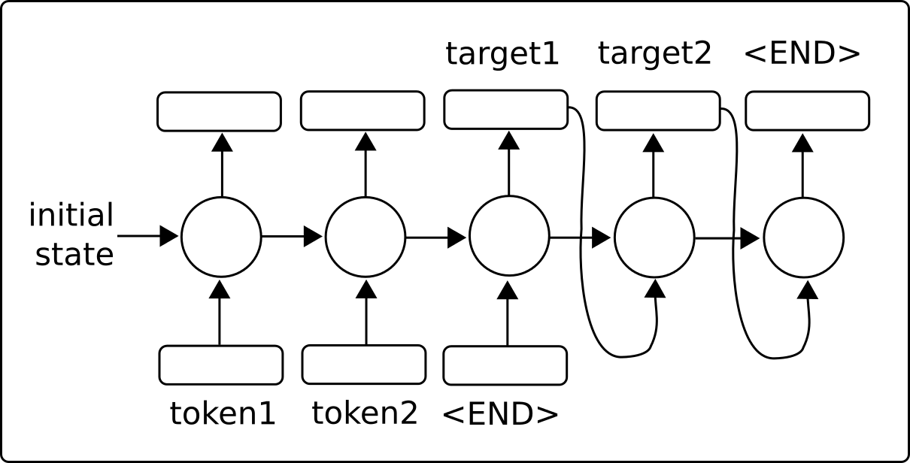
  </a>
</kbd>
<kbd>
  <a href="09_Recurrent_Neural_Networks/02_Implementing_RNN_for_Spam_Prediction">
    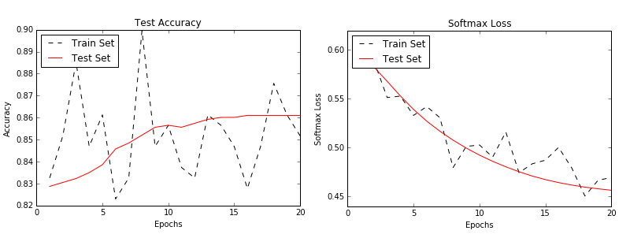
  </a>
</kbd>
<kbd>
  <a href="09_Recurrent_Neural_Networks/03_Implementing_LSTM">
    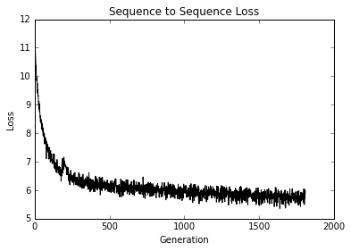
  </a>
</kbd>
<kbd>
  <a href="09_Recurrent_Neural_Networks/04_Stacking_Multiple_LSTM_Layers">
    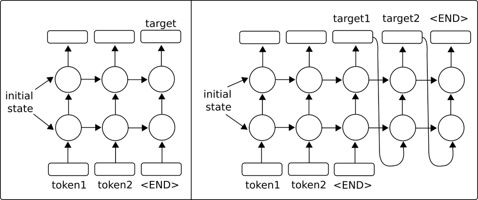
  </a>
</kbd>
<kbd>
  <a href="09_Recurrent_Neural_Networks/05_Creating_A_Sequence_To_Sequence_Model">
    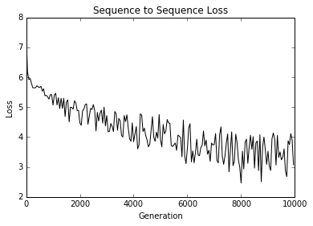
  </a>
</kbd>
<kbd>
  
</kbd>

Recurrent Neural Networks (RNNs) are very similar to regular neural networks except that they allow 'recurrent' connections, or loops that depend on the prior states of the network. This allows RNNs to efficiently deal with sequential data, whereas other types of networks cannot. We then motivate the usage of LSTM (Long Short Term Memory) networks as a way of addressing regular RNN problems. Then we show how easy it is to implement these RNN types in TensorFlow.

 1. [Introduction](09_Recurrent_Neural_Networks/01_Introduction)
  * We introduce Recurrent Neural Networks and how they are able to feed in a sequence and predict either a fixed target (categorical/numerical) or another sequence (sequence to sequence).
 2. [Implementing an RNN Model for Spam Prediction](09_Recurrent_Neural_Networks/02_Implementing_RNN_for_Spam_Prediction)
  * In this example, we create an RNN model to improve on our spam/ham SMS text predictions.
 3. [Implementing an LSTM Model for Text Generation](09_Recurrent_Neural_Networks/03_Implementing_LSTM)
  * We show how to implement a LSTM (Long Short Term Memory) RNN for Shakespeare language generation. (Word level vocabulary)
 4. [Stacking Multiple LSTM Layers](09_Recurrent_Neural_Networks/04_Stacking_Multiple_LSTM_Layers)
  * We stack multiple LSTM layers to improve on our Shakespeare language generation. (Character level vocabulary)
 5. [Creating a Sequence to Sequence Translation Model (Seq2Seq)](09_Recurrent_Neural_Networks/05_Creating_A_Sequence_To_Sequence_Model)
  * Here, we use TensorFlow's sequence-to-sequence models to train an English-German translation model.
 6. [Training a Siamese Similarity Measure](09_Recurrent_Neural_Networks/06_Training_A_Siamese_Similarity_Measure)
  * Here, we implement a Siamese RNN to predict the similarity of addresses and use it for record matching.  Using RNNs for record matching is very versatile, as we do not have a fixed set of target categories and can use the trained model to predict similarities across new addresses.

## [Ch 10: Taking TensorFlow to Production](10_Taking_TensorFlow_to_Production)
<kbd>
  
</kbd>
<kbd>
  
</kbd>
<kbd>
  
</kbd>
<kbd>
  
</kbd>
<kbd>
  
</kbd>

Of course there is more to TensorFlow than just creating and fitting machine learning models.  Once we have a model that we want to use, we have to move it towards production usage.  This chapter will provide tips and examples of implementing unit tests, using multiple processors, using multiple machines (TensorFlow distributed), and finish with a full production example.

 1. [Implementing Unit Tests](10_Taking_TensorFlow_to_Production/01_Implementing_Unit_Tests)
  * We show how to implement different types of unit tests on tensors (placeholders and variables).
 2. [Using Multiple Executors (Devices)](10_Taking_TensorFlow_to_Production/02_Using_Multiple_Devices)
  * How to use a machine with multiple devices.  E.g., a machine with a CPU, and one or more GPUs.
 3. [Parallelizing TensorFlow](10_Taking_TensorFlow_to_Production/03_Parallelizing_TensorFlow)
  * How to setup and use TensorFlow distributed on multiple machines.
 4. [Tips for TensorFlow in Production](10_Taking_TensorFlow_to_Production/04_Production_Tips)
  * Various tips for developing with TensorFlow
 5. [An Example of Productionalizing TensorFlow](10_Taking_TensorFlow_to_Production/05_Production_Example)
  * We show how to do take the RNN model for predicting ham/spam (from Chapter 9, recipe #2) and put it in two production level files: training and evaluation.

## [Ch 11: More with TensorFlow](11_More_with_TensorFlow)

<kbd>
  <a href="11_More_with_TensorFlow/01_Visualizing_Computational_Graphs">
    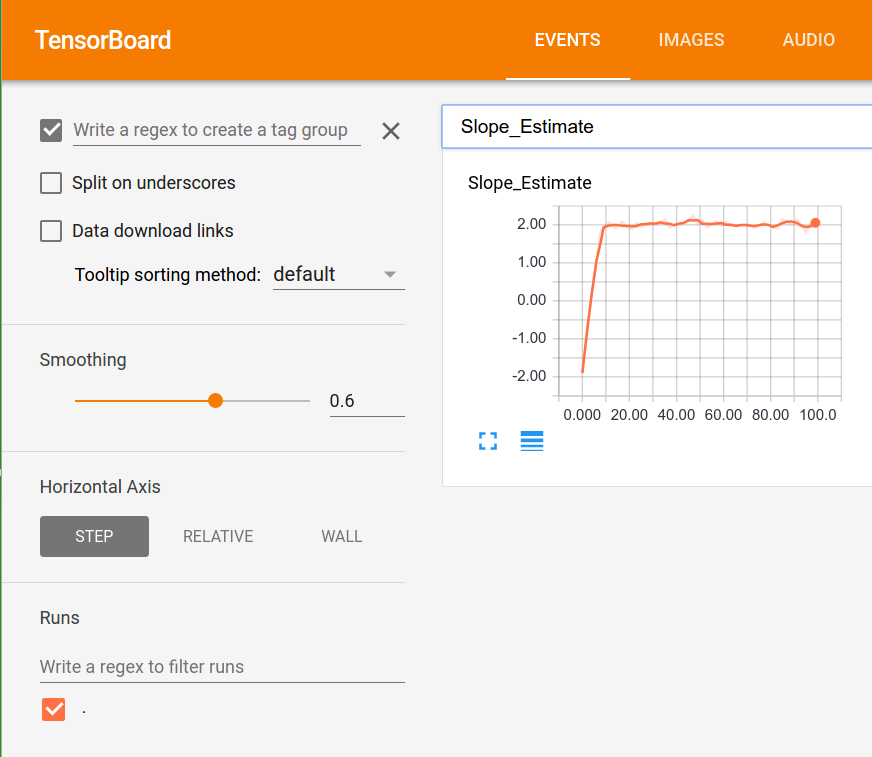
  </a>
</kbd>
<kbd>
  <a href="11_More_with_TensorFlow/02_Working_with_a_Genetic_Algorithm">
    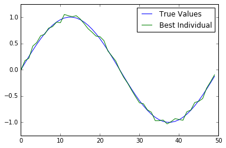
  </a>
</kbd>
<kbd>
  
</kbd>
<kbd>
  
</kbd>

To illustrate how versatile TensorFlow is, we will show additional examples in this chapter. We start with showing how to use the logging/visualizing tool Tensorboard.  Then we illustrate how to do k-means clustering, use a genetic algorithm, and solve a system of ODEs.

 1. [Visualizing Computational Graphs (with Tensorboard)](11_More_with_TensorFlow/01_Visualizing_Computational_Graphs)
  * An example of using histograms, scalar summaries, and creating images in Tensorboard.
 2. [Clustering Using K-means](11_More_with_TensorFlow/03_Clustering_Using_KMeans)
  * How to use TensorFlow to do k-means clustering.  We use the Iris data set, set k=3, and use k-means to make predictions.
 3. [Working with a Genetic Algorithm](11_More_with_TensorFlow/02_Working_with_a_Genetic_Algorithm)
  * We create a genetic algorithm to optimize an individual (array of 50 numbers) toward the ground truth function.
 4. [Solving a System of ODEs](11_More_with_TensorFlow/04_Solving_A_System_of_ODEs)
  * Here, we show how to use TensorFlow to solve a system of ODEs.  The system of concern is the Lotka-Volterra predator-prey system.
